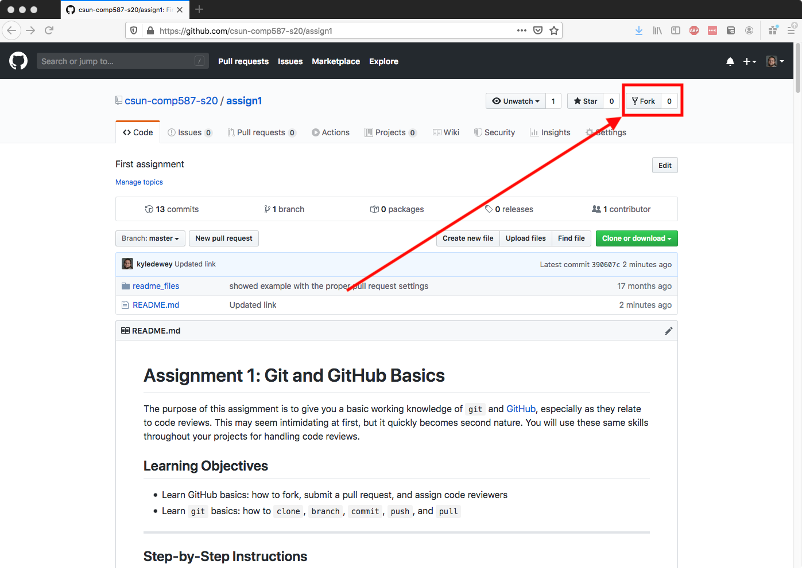
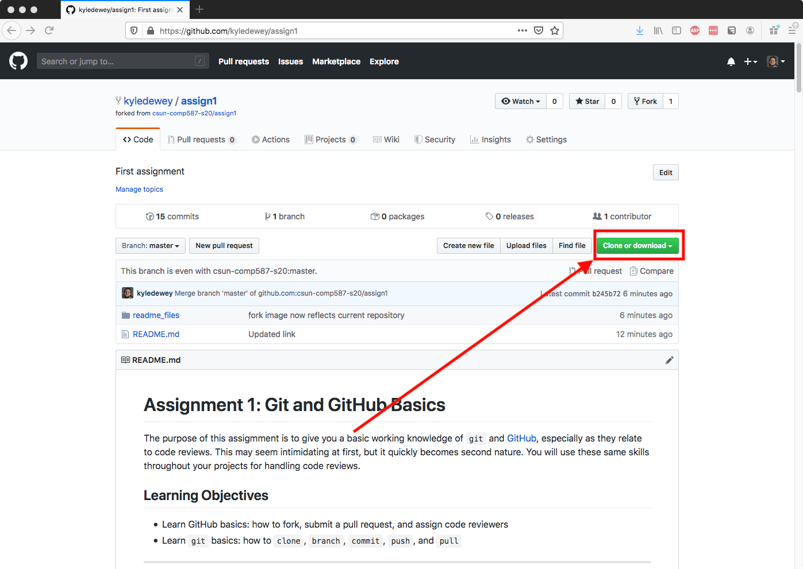
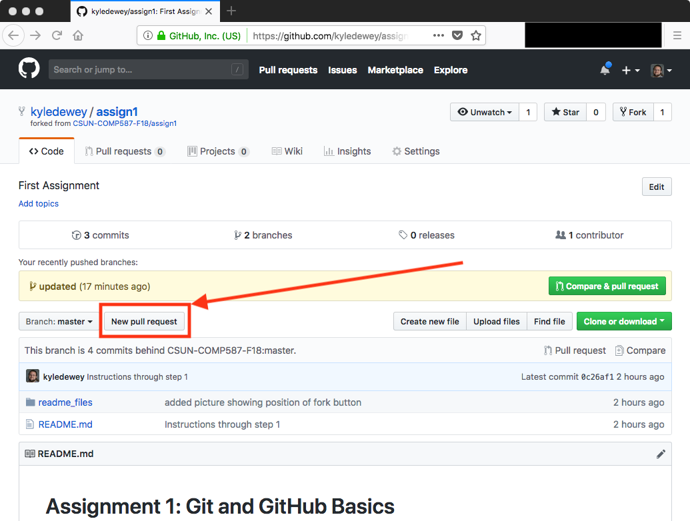
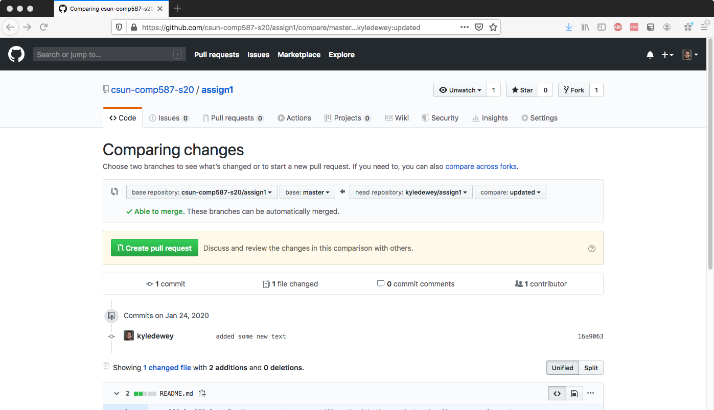

# Assignment 1: Git and GitHub Basics #

The purpose of this assigmment is to give you a basic working knowledge of `git` and [GitHub](https://github.com/), especially as they relate to code reviews.
This may seem intimidating at first, but it quickly becomes second nature.
You will use these same skills throughout your projects for handling code reviews.

## Learning Objectives ##

- Learn GitHub basics: how to fork, submit a pull request, and assign code reviewers
- Learn `git` basics: how to `clone`, `branch`, `commit`, `push`, and `pull`

-----------

## Step-by-Step Instructions ##

### Step 0: Create a GitHub Account ###

If you do not already have a [GitHub](https://github.com/) account, create one now.
This should only take a couple minutes, and it's free.
If you already have an account, you can use your existing account.

### Step 1: Fork this Repository ###

Go to the [main repository webpage](https://github.com/csun-comp587-s20/assign1) for this repository.
[Fork](https://guides.github.com/activities/forking/) this repository over to **your own account**, using the button circled below:


A fork is effectively a copy of the entire repository, frozen at the point when you created the fork.
You own this copy and have complete control over it.
Notably, if the original repository changes, your fork will **not** automatically change; you created the copy from a specific point in time.
We'll come back to this in a bit.

### Step 2: Clone your Fork ###

> The remainder of these steps assume you're using the `git` command on the command-line.
> On Linux, this should be available through your package manager if it isn't already installed.
> On Mac, `git` is bundled with the normal developer tools, and on recent versions merely typing `git` will prompt you to install the developer tools.
> On Windows, these commands can be downloaded [here](https://git-scm.com/downloads).
> There are also a number of GUI tools out there for handling `git`.
> You may use whatever you want.

Go to your main GitHub page (should be `github.com/your_username`), and click the `Repositories` tab.
Your fork should be listed here.
Click on your fork, and then click the `Clone or download` button, circled below:


Clicking this button will display a URL, which will be something like `git@github.com:your_username/assign1.git`.
Have this URL handy somewhere (or even better, copy it to the clipboard).

On your local machine, go to a directory that makes sense to you for this assignment.
This will probably be a directory named `comp587`, or something like that.
In that directory, issue the following command:

```console
git clone URL
```

...where `URL` is the URL above.
This will download all the files in your fork to the local `assign1` directory, underneath whatever directory you're in.
(The `assign1` directory will be created automatically.)

Don't make any changes just yet; there is still some setup we need to do.

### Step 3: Setup your Fork to Sync with the Original ###

At the end of the first step, it was established that your fork is a **copy** of the original repository, frozen in a certain point in time.
While this has its uses, it's a little annoying, because we often want to be in sync with the original repository.

To keep things in sync, we will take advantage of a `git` feature known as [remotes](https://git-scm.com/book/en/v2/Git-Basics-Working-with-Remotes).
For our purposes, a _remote_ is a glorified URL pointing to a remotely-accessible `git` repository somewhere.
If you type the following command:

```console
git remote -v
```

...you'll see all the remotes that you already have setup.
This should give you output like the following:

```
origin	git@github.com:your_username/assign1.git (fetch)
origin	git@github.com:your_username/assign1.git (push)
```

The above information states that you have one remote named `origin`, from which you can both download (`fetch`) and upload (`push`) files.
By convention, `origin` is wherever the "home" of this repository is, which corresponds to your particular fork.

To keep things in sync with the original repository, we'll add the original repository as a remote.
First, get the `Clone or download` URL from the **original** repository, using the same process as in Step 2.
Then, run the following command:

```console
git remote add upstream URL
```

...where `URL` is the URL from the original repository.
This command states to add a new remote named `upstream`, which points to `URL`.
By convention, `upstream` points to the source we forked from.
You can confirm that this command worked by running `git remote -v` again.

Note that this step only establishes where to sync from; it doesn't actually perform the syncing.
Moreover, this syncing is not done automatically, nor would you generally want it to be automatic.
We won't get into how to sync in this assignment, but see [these instructions](https://help.github.com/articles/syncing-a-fork/) if you're curious.
It's good practice to establish the `upstream` immediately, even if you aren't going to use it immediately, and I want you to get in the habit of doing this.

### Step 4: Create a New Local Branch ###

In this step, we'll introduce _branches_, which are an essential `git` feature.
Branches essentially allow you to split into a sort of parallel universe with respect to your code.
In one universe (the original universe), your code is completely unchanged.
In another universe (the branched universe), you make changes to your code.
From a you-centric standpoint, this allows you to easily switch back and forth between the original and modified code.
You can add features, make changes, fix bugs, etc., all without worried about breaking functionality that's already there.
After all, if a branch goes completely off the rails and everything breaks, you can always switch back to the original branch, as if nothing changed.

From a we-centric standpoint, branches allow us to selectively isolate ourselves from each other.
Instead of everyone modifying the same code (involving lots of us stepping on each other's toes), we modify _branches_.
Ideally, only one or few developers are working on a branch at a time, minimizing the amount of work caused by someone changing something out from under you.
With this in mind, it's good practice to **always** make changes on a branch, as opposed to the original code.
Eventually, you're changes will need to be incorporated into the original code; we'll get to that in a bit.

First, let's see what branches you have already.
Type the following command:

```console
git branch
```

You should see the following:

```
* master
```

The `*` states that you're currently on a branch named `master`, and the lack of other output means that `master` is the only branch available.
By convention, `master` is usually available on all GitHub repositories, and it's considered to be where the most stable version of your software exists.
The `master` branch should _always_ compile, and it should be relatively bug-free.

Let's make a new branch, using the following command:

```console
git checkout -b updated
```

This creates a new branch named `updated`, which splits off from the `master` branch.
If you run `git branch` again, you should see the following:

```
  master
* updated
```

Now there are two branches (`master` and `updated`), and the `*` denotes that you're on the `updated` branch.

### Step 5: Improve this Text ###

Make an edit to this file (`README.md`), which is in [Markdown](https://en.wikipedia.org/wiki/Markdown) (specifically [GitHub-flavored Markdown](https://github.github.com/gfm/)) format.
Your edit should somehow improve the content.
This can mean adding further descriptions, adding demonstrative pictures, etc.

### Step 6: Commit Your Changes ###

`git` knows what the state of the branch was before you started making edits, and will show you the changes made since your last _commit_.
A commit is an explicit point where you effectively say "save this content".
Commits represent the content of all files at distinct points in time.
Being tanglible things, `git` allows us to do things like view code as it was at a particular commit, undo the changes made at a commit, and so on.

First, let's see what has changed.
You can do this with the following command:

```console
git status
```

This will give you output something like the following:

```
On branch updated
Changes not staged for commit:
  (use "git add <file>..." to update what will be committed)
  (use "git checkout -- <file>..." to discard changes in working directory)

	modified:   README.md

Untracked files:
  (use "git add <file>..." to include in what will be committed)

	temp.txt

no changes added to commit (use "git add" and/or "git commit -a")
```

The above output states that `README.md` has changed since your last commit, and that the file `temp.txt` has been added.
You must explicitly tell `git` which files to _stage_ for a commit, where a staged file becomes part of the commit.
You can stage files with `git add`, like so:

```console
git add README.md temp.txt
```

The above command states that changes to `README.md` are part of this commit, and that `temp.txt` is similarly part of this commit.

You can use `git status` again to see the effect of this staging.
For this particular example, we see the following:

```
On branch updated
Changes to be committed:
  (use "git reset HEAD <file>..." to unstage)

	modified:   README.md
	new file:   temp.txt
```

The above output summarizes the changes this commit is introducing relative to the last commit, namely that `README.md` is modified, and that we've added `temp.txt`.

Once everything you want is staged, you can commit your changes like so:

```console
git commit
```

This will bring up an editor (honoring the `$EDITOR` environment variable), allowing you to write a descriptive message (the _commit message_) for your commit.
Once you save your message, your commit will be done.
You can verify that your commit did something like so:

```console
git log
```

The above command will list all the commits that have happened to your code, underneath the branch you're on.
The first commit listed will be the one you just made, and will include your commit message.

### Step 7: Push your Branch and Your Changes ###

While you have made changes and they are safely in your branch, this branch exists only on your machine.
You need to explicitly upload this branch to the server.
This can be done with the following command:

```console
git push -u origin updated
```

This command states to _push_ (upload) your `updated` branch to the `origin` remote.
This will make the `updated` branch available to anyone else working on your repository.
Additionally, if your machine were to fail, your `updated` branch would still be safe and sound online.

Incidentally, if you make further commits to your branch, you need to explicitly upload them with this command.
On subsequent runs, `git` will default to using the `origin` remote for the `updated` branch, so you'd only need to run:

```console
git push
```

### Step 8: Submit a Pull Request ###

Almost everything discussed so far has been about selective isolation of your code from the rest of the codebase.
Ultimately, your changes need to end up back in the original codebase.
Oftentimes, you won't have write access to the codebase.
However, GitHub makes it easy to communicate your proposed modifications to those who _do_ have write access to the codebase.

You can communicate these changes via a _pull request_, wherein you request that the original authors _pull_ your code into their codebase.
This allows authors to carefully control what ends up into the codebase, and what doesn't.
Usually, this isn't a simple yes/no, but rather the start of a discussion.
Authors may suggest edits, or make edits themselves, via additional commits on top of what you've submitted.

Throughout this process, GitHub will correctly show you as the author of your original commits; you don't lose ownership during this process.
Similarly, if the authors accept your changes (with potential modifications), GitHub will still show you as the author of your work, and will list you as a contributor to a project.
For example, I am listed as a contributor to [`hyper`](https://github.com/hyperium/hyper), even though I don't have write access to the repository.

To start a pull request submission, first click the `New pull request` button on your main repository webpage, circled below:


After clicking this button, you'll see an interface where you can specify exactly what code you want to be pulled in, and where you'd like it pulled in.
In this case, we want to pull into the `master` branch of the original repository, from your own `updated` branch.
You can click the drop-down boxes to make this happen.
After you make all your selections, you should see something like the following:


From here, click the green `Create pull request` button.
This will open a page where you can name your pull request, and give it a description.
Your name and description should concisely describe the changes you've made.

Once you write the name and description, click the green `Create pull request` button again, which will submit the pull request.
In the next assignment, we'll work with these submitted pull requests for code reviewing purposes.

## Retrospective ##

In this assignment, you've gone over some basics of using `git` and GitHub.
You've forked and cloned repositories, made branches, committed code, and submitted a pull request.
While this barely scratches the surface of what you can do with `git`, this describes ~80-90% of commonly-used functionality.
